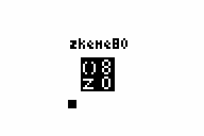

# zkeme80 - a Forth-based OS for TI-84+ calculators written in Scheme


**TLDR:** `assembler.scm` is the assembler.  There are no file
dependencies, but your Scheme implementation needs to be recent enough
to have the required modules to support things like bytevectors and
`sfri-9` records.  Works on Guile, hasn't been tested on other
implementations.

## Building the operating system
Thanks to `clever` on `#nixos`, if you clone the repository and run
the following:

```shell
nix-build . -A runit && ./result
```

A TI calculator emulator will be built and my ROM will be loaded.  Try
it today!

## Motivation
Existing assemblers for the Z80 (and other instruction sets) are
extremely lacking in their macro abilities.  This limits their
abstraction, especially when the programmer wishes to create data
structures in assembly through macros (e.g. a linked list of
dictionary entries).  What better macro system exists than Lisp?

## Files included
- `assembler.scm` assembles s-exps assembly code into binary.  Simply
  run `(load "assembler.scm")` into your Scheme REPL and
  run`(assemble-prog sample-prog)` to see the binary data.  Run
  `(assemble-to-file sample-prog "out.bin")` to write a binary file.
- `smiley-os.scm` and its helper files are associated with my
  Forth-based operating system.  Load `smiley-os.scm` then run
  `(make-rom "out.rom")` to generate binary to a file `out.rom`.


## Design of the assembler
The assembler heavily relies on pattern matching.  The program counter
is implemented as a mutable Scheme object `*pc*`.  Labels are kept in
a global alist `*labels*`.  To allow for the use of jumps that refer
to labels declared after it, we use multiple passes.

### Structure of assembly programs
Assembly programs consist of a list of elements that are either
expressions or procedures.

### Pass 1
#### Handling expressions
Each expression of a program is passed to `assemble-expr` (which also
checks for if they're well-formed).  `assemble-expr` returns a record
type that has the following fields (for a normal instruction):

| Record entry | Type      | Description                                       |
| :-:          | :-:       | :-:                                               |
| `cycles`     | `integer` | The number of cycles this instruction takes.      |
| `length`     | `integer` | The length of the instruction, in bytes.          |
| `gen-instr`  | `lambda`  | Thunk that computes the actual instruction bytes. |

The use of converting expressions into record types like this allows
us to compute the length of the program (and resolve look ahead
labels).

#### Handling procedures
Procedures (Scheme objects that satisfy the predicate `procedure?`)
that are embedded in a program must be able to be run without any
arguments, and return either `()` or an instruction record.  This is
the main extension mechanism for the assembler.  For instance, in
`macros.scm` there is a procedure called `fill-until-end` which
creates a list of bytes so that the total binary is `#x100000` bytes
long.

### Pass 2
Once the program makes it through Pass 1, we perform code generation
and label resolution.  All instruction records are required to have a
`length` property that tells in advance how many bytes will be
generated from the thunk.  Consistency between this number and what
the thunk outputs is checked.  Each instruction record is also checked
that it generates only unsigned 8-bit integers.  The result is
flattened into a list of unsigned numbers, which can be manipulated as
the user wishes.

## Debugging
The debugging process is pretty simple.  One just has to write a valid
Z80 assembly program in my s-exp format and run it through a
disassembler then compare the output.  If you're feeling particularly
brave you may skip this step and try your program out on a Z80 chip.

## Limitations
I don't currently have an instruction encoding as a data structure, so
to add new instructions the current workflow is to look at relevant
portions of the Z80 data sheet and write new cases in the pattern
matcher.
